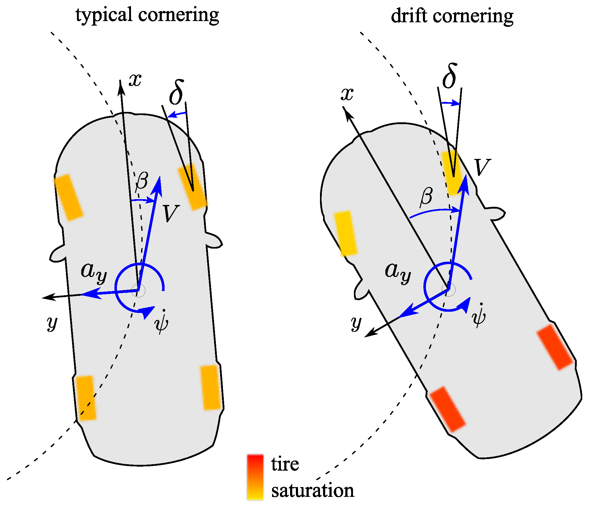
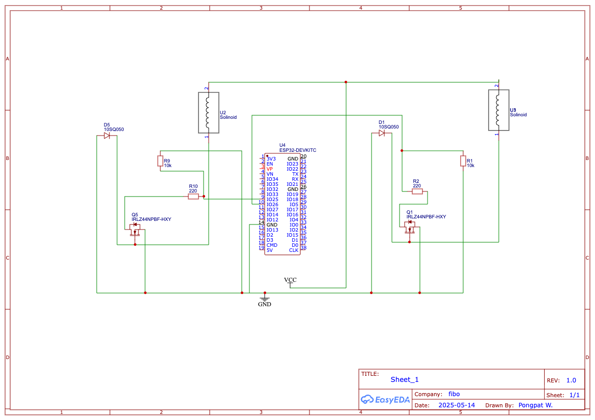
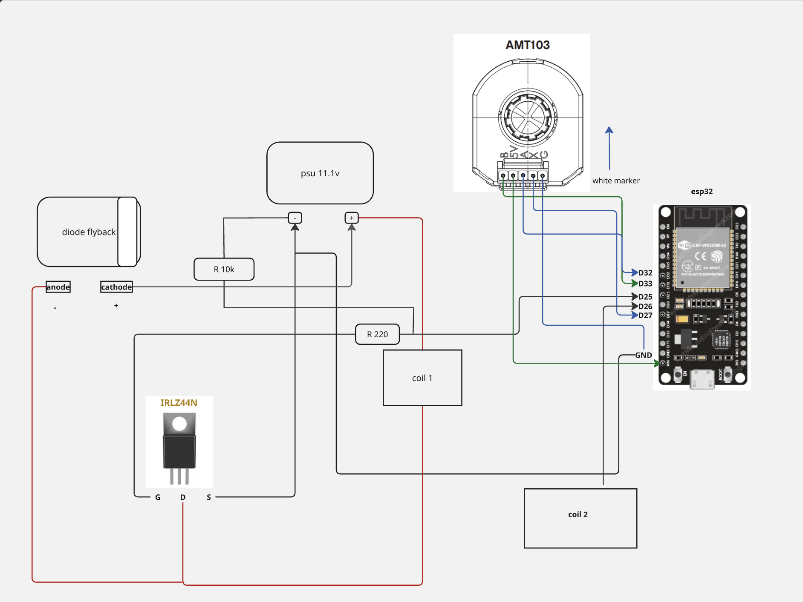
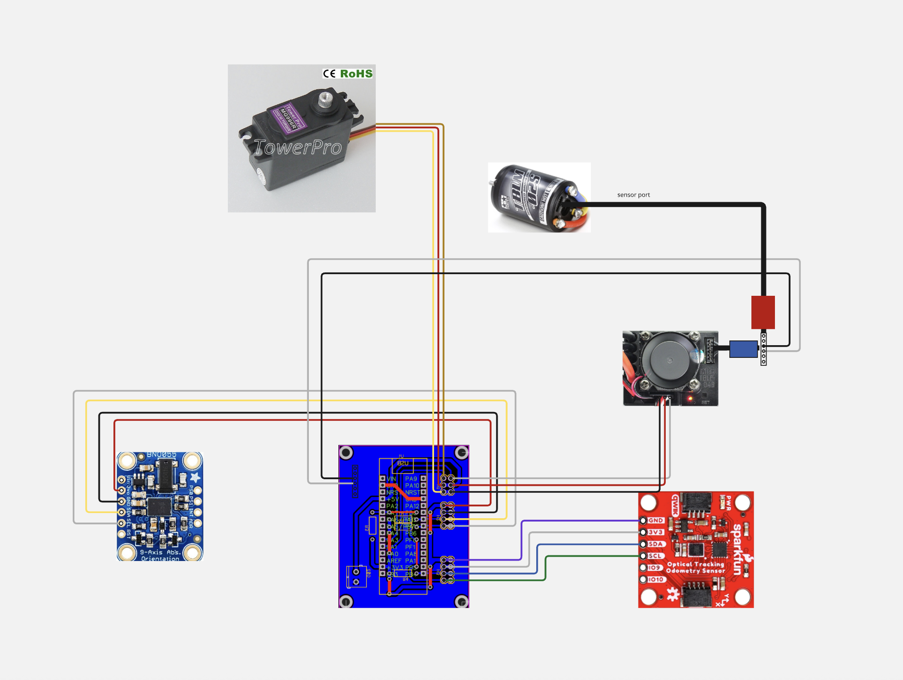
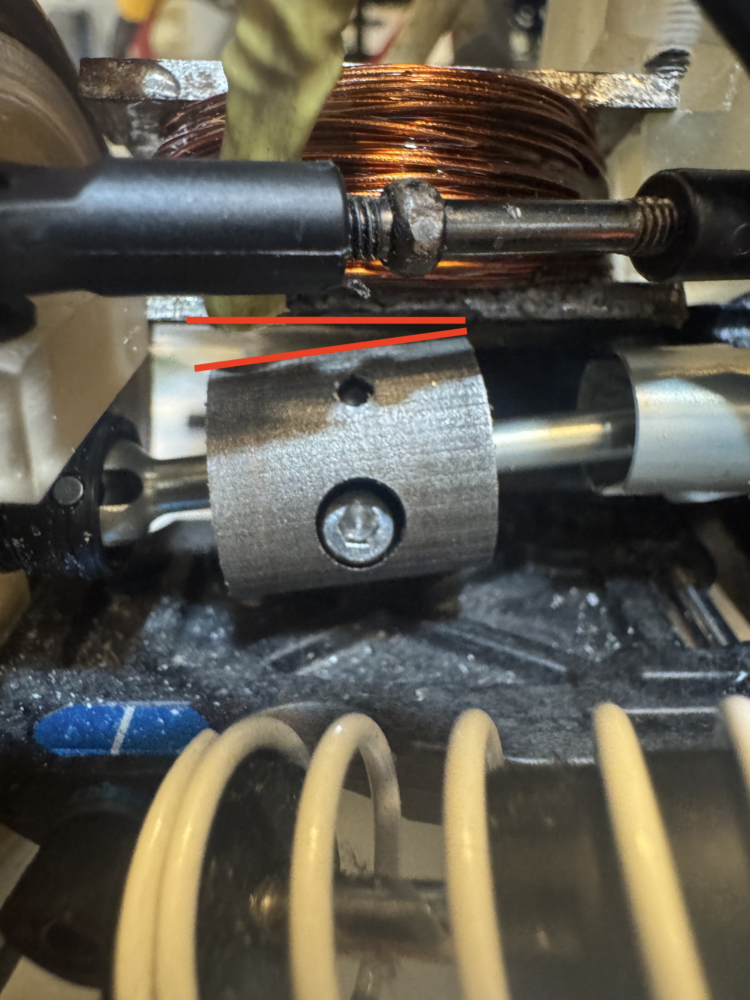

## Drift Concept

Drifting is a driving technique that involves intentionally inducing **oversteer**, causing a loss of traction in the rear wheels while maintaining control throughout a corner. In this project, we focus on enabling controlled drift by tuning the balance between **traction**, **power**, and **braking force**, especially with a **rear-wheel drive (RWD)** configuration.

    

- In **typical cornering**, the front tires steer in the direction of the curve while the rear tires maintain grip.
- In **drift cornering**, the car rotates into the turn with the **rear tires saturated**, sliding outward, while the front wheels counter-steer to guide the direction.
- The vehicle exhibits a **high sideslip angle (β)** and controlled **yaw rate (ψ)**, while lateral acceleration (**aᵧ**) still points toward the center of the curve.

## Things to Consider

- Rear tire traction is intentionally reduced to initiate drift.
- Front tires must maintain enough grip for counter-steering control.
- Weight transfer helps unsettle the rear end.
- Tire compound and surface friction significantly affect driftability.
- Balance between motor torque and braking response is critical for stable drift control.

## Transmisstion system
Originally based on an all-wheel-drive (AWD) layout, the F1TEETH platform has been modified to **rear-wheel drive (RWD)** to improve the ability to break traction at the rear wheels. This configuration allows better control over drifting behavior and enables intentional oversteer, which is essential for sustained drifts.

To achieve this, the **driveshaft connecting the motor to the front wheels was removed**, effectively disabling the front-wheel drive and converting the system into a purely rear-wheel-driven platform.

## Braking System
I chose to use a magnetic braking system because it requires the **least amount of space for installation**, especially compared to traditional servo-based brakes, which are often bulky. The magnetic setup is also **lighter in weight**, making it more suitable for small-scale RC vehicles. Additionally, this design allows for the possibility of implementing **ABS-like behavior**, helping the car come to a stop smoothly and precisely with minimal wheel lock-up.

## Schematic & Wiring Diagram

    

    

    

<!-- * **Braking Schematic:** [Braking Schematic](/.images/Schematic_break_2025-06-20.png) -->

### Drum Brake Specifications
| Property         | Value   |
|------------------|---------|
| Outer Diameter   | 14.5 mm |
| Drump Thickness   | 3 mm    |
| Axial Length     | 15.6 mm |

### Coil Specifications

| Property         | Value              |
| ---------------- | ------------------ |
| Core Type        | Steel              |
| Outer Diameter   | 12 mm              |
| Inner Diameter   | 8 mm               |
| Wire Used        | 0.5 mm magnet wire |
| Power            | 12V DC             |
| Resistance       | \~1.5 Ω            |
| Current          | \~8 A              |
| Application Load | \~2 kg             |

### Magnetic Force Estimation

| Symbol | Value          | Description                   |
| ------ | -------------- | ----------------------------- |
| N      | 270 turns      | Number of coil windings       |
| I      | 8 A            | Coil current                  |
| A      | 1.13 × 10⁻⁴ m² | Core area (radius = 6 mm)     |
| g      | 0.0003 m       | Air gap (0.3 mm)              |
| μᵣ     | 1000           | Relative permeability (steel) |
| μ₀     | 4π × 10⁻⁷ H/m  | Vacuum permeability constant  |

$$
F = \frac{N^2 \cdot \mu \cdot A \cdot I^2}{2 \cdot g^2}
$$

***Estimated force:** 60 N at full load > RC car mass 3 KG

## Tesing & Result 

### Front vs Rear Wheel Understeering

The following videos demonstrate the difference in understeering behavior between front-wheel and rear-wheel drive configurations:

- [Front wheel understeering F1TEETH](https://youtu.be/fvo7P59drMA) — In front-wheel drive, **understeer typically requires braking** to shift the weight forward and reduce rear traction. Without braking, the front wheels tend to maintain grip, limiting the ability to rotate the vehicle.
- [Rear wheel understeering F1TEETH](https://youtu.be/cZtpaluhPYI) — In rear-wheel drive, the car can **naturally induce understeer without braking**, due to rear torque overpowering traction. This makes it easier to break rear grip and start a drift even without applying the brake.

### 🧪 Inertial Braking Test Results

To test the effectiveness of each braking method, the car was released from a fixed starting point and allowed to accelerate under consistent conditions. The braking system was activated when the car reached a marked finish line. Two braking methods were compared:

1. **ESC Brake** — electronic braking via the speed controller
2. **Coil Brake** — electromagnetic braking using the custom coil 

| Attempt | ESC Brake Distance | Coil Brake Distance |
|---------|---------------------|----------------------|
| 1       | 290 mm              | 144 mm               |
| 2       | 280 mm              | 180 mm               |
| 3       | 300 mm              | 165 mm               |

**Observation:**  
The coil brake consistently results in shorter stopping distances, confirming its ability to reduce rotational inertia more effectively than standard ESC braking. This allows the car to enter drift states more predictably and stop in tighter spaces.

### Known Issues (MK I)

* **1.1** Mount misalignment between the coil’s actuator surface and the brake dump

    

### Roadmap

- [ ] Connect circuit board with opto-isolate
- [ ] Front Break
- [ ] replace DIY Board with pcb 
- [ ] Reposition the shock absorber mounting

## Ref

[A Torque Vectoring Control for Enhancing Vehicle Performance in Drifting](https://www.mdpi.com/2079-9292/7/12/394)

[How To Winding the Magnet Wire](https://www.instructables.com/POWERFUL-ELECTROMAGNET-5KG-LIFTING/)